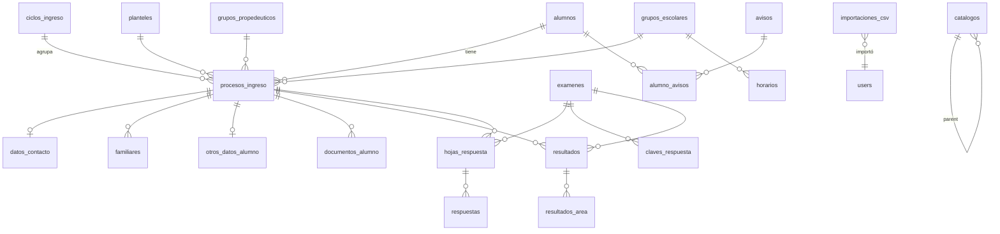

# 02 — Modelo de Datos
BD producción: `u132762550_COBAEM` (MariaDB, utf8mb4_unicode_ci, InnoDB). Convención: tablas y columnas en español, snake_case, plural.

---

## 1. Diagrama entidad-relación (resumen)

## 2. Tablas núcleo

### alumnos — identidad permanente
| Columna | Tipo | Notas |
|---|---|---|
| id | BIGINT UNSIGNED PK | |
| curp | CHAR(18) | **UNIQUE**. Validada con regex oficial + dígito verificador |
| nombres, primer_apellido | VARCHAR(100) | NOT NULL |
| segundo_apellido | VARCHAR(100) NULL | |
| fecha_nacimiento | DATE | Segundo factor de acceso (SEG-02) |
| sexo_id, nacionalidad_id, estado_civil_id | FK → catalogos | |
| entidad_nacimiento_id, municipio_nacimiento_id | FK → catalogos | Dependientes |
| timestamps | | |

`nombre_completo` y `edad` NO se almacenan: son accessors calculados (evita inconsistencia).

### ciclos_ingreso
| Columna | Tipo | Notas |
|---|---|---|
| id | PK | |
| anio | SMALLINT | UNIQUE. Ej. 2026 |
| periodo_escolar | VARCHAR(10) | Ej. "26-2" |
| generacion | VARCHAR(50) | "Nuevo ingreso 2026" |
| activo | BOOL | Solo un ciclo activo para registro |
| registro_abierto_desde / _hasta | DATETIME NULL | Ventana de edición (SEG-06) |

### planteles
id, clave (ej. "ARIO", UNIQUE), nombre, clave_oficial, direccion, activo.

### procesos_ingreso — corazón del sistema
| Columna | Tipo | Notas |
|---|---|---|
| id | PK | |
| alumno_id | FK alumnos | |
| ciclo_ingreso_id | FK | |
| plantel_id | FK | |
| folio_registro | VARCHAR(30) | **UNIQUE**. `NI-{AÑO}-{PLANTEL}-{####}` |
| folio_examen | VARCHAR(20) NULL | **UNIQUE(folio_examen, ciclo_ingreso_id)** |
| semestre_solicitado | TINYINT | Default 1 |
| tipo_estudiante_id, paraescolar_id | FK catalogos | paraescolar NULL |
| secundaria_procedencia_id | FK catalogos NULL | + entidad/municipio/tipo/turno secundaria (FK catalogos) |
| promedio_secundaria | DECIMAL(4,2) | |
| grupo_propedeutico_id | FK NULL | |
| grupo_escolar_id | FK NULL | |
| matricula | VARCHAR(20) NULL | **UNIQUE** cuando no NULL |
| estatus_proceso | VARCHAR(30) | enum app: registro_incompleto, registrado, validado... |
| estatus_documentacion | VARCHAR(30) | agregado calculado/cacheado |
| edicion_bloqueada | BOOL default false | RF-15 |
| plantilla_pdf_version | VARCHAR(10) | ADR-07, ej. "v2026" |
| acepto_privacidad_at | DATETIME | obligatorio al registrar |
| fecha_registro, fecha_validacion | DATETIME NULL | |
| timestamps, softDeletes | | |

Índices: `(ciclo_ingreso_id, estatus_proceso)`, `(alumno_id, ciclo_ingreso_id)` UNIQUE.

### datos_contacto (1:1 con proceso)
proceso_ingreso_id UNIQUE FK, telefono, celular (NOT NULL), correo, municipio_id, localidad_id, colonia, domicilio, codigo_postal.

### familiares
proceso_ingreso_id FK, tipo_familiar ENUM(tutor, madre, padre, otro), nombres, apellidos, telefono, celular, ocupacion_id NULL, estudios_id NULL. UNIQUE(proceso_ingreso_id, tipo_familiar).

### otros_datos_alumno (1:1)
proceso_ingreso_id UNIQUE FK, no_seguro_medico, beca_id NULL, estatura DECIMAL(3,2), peso DECIMAL(5,2), tipo_sangre_id NULL.

### documentos_alumno
proceso_ingreso_id FK, tipo_documento_id FK catalogos, estado_documento VARCHAR(30) (pendiente, recibido, validado, rechazado, requiere_correccion, no_aplica), observacion, fecha_recepcion, validado_por FK users NULL, fecha_validacion. UNIQUE(proceso_ingreso_id, tipo_documento_id).

## 3. Evaluación y OMR

### examenes
ciclo_ingreso_id FK, nombre, tipo ENUM(diagnostico_inicial, evaluacion_posterior), fecha_aplicacion, version, total_preguntas SMALLINT, plantilla_omr_id NULL (FK plantillas_omr), activo.

### claves_respuesta
examen_id FK, pregunta SMALLINT, respuesta_correcta CHAR(1), area_id FK catalogos, materia_id FK catalogos NULL, competencia VARCHAR(150) NULL, ponderacion DECIMAL(5,2) default 1. UNIQUE(examen_id, pregunta).

### plantillas_omr
id, nombre, examen_tipo, definicion_json JSON (zonas de respuesta, nº preguntas, opciones, zona de folio), activo. Se replica al servicio OMR.

### hojas_respuesta
examen_id FK, proceso_ingreso_id FK NULL (se vincula al validar folio), folio_examen VARCHAR(20) NULL, imagen_original_path, imagen_procesada_path NULL, estado_procesamiento ENUM(pendiente, procesada, requiere_revision, validada, exportada, error), confianza_lectura DECIMAL(5,2) NULL, observaciones, procesado_por FK users, fecha_subida, timestamps. Índice (examen_id, estado_procesamiento).

### respuestas
hoja_respuesta_id FK, pregunta SMALLINT, respuesta_detectada CHAR(1) NULL, respuesta_validada CHAR(1) NULL, confianza DECIMAL(5,2), requiere_revision BOOL, corregida_manualmente BOOL. UNIQUE(hoja_respuesta_id, pregunta). Valores especiales: NULL = sin marca; 'X' = doble marca.

### resultados
proceso_ingreso_id FK, examen_id FK, origen ENUM(calculado, importado), puntaje_total DECIMAL(6,2), porcentaje_total DECIMAL(5,2), nivel_riesgo_id FK catalogos, nivel_desempeno_id FK catalogos, fecha_calculo. UNIQUE(proceso_ingreso_id, examen_id).

### resultados_area
resultado_id FK, area_id FK catalogos, puntaje, porcentaje, nivel_riesgo_id, recomendacion TEXT NULL. UNIQUE(resultado_id, area_id).

Comparativo inicial vs posterior: consulta sobre los dos `resultados` del mismo proceso (no tabla propia).

## 4. Grupos, horarios, publicación

### grupos_propedeuticos
ciclo_ingreso_id FK, nombre (ej. "P-03"), aula, horario_texto, fecha_inicio, fecha_fin, responsable, indicaciones TEXT, materiales_requeridos TEXT, activo. UNIQUE(ciclo_ingreso_id, nombre).

### grupos_escolares
ciclo_ingreso_id FK, grupo (ej. "1-A"), semestre, turno_id FK catalogos, aula_base, fecha_inicio_clases DATE, indicaciones TEXT, activo. UNIQUE(ciclo_ingreso_id, grupo).

### horarios
grupo_escolar_id FK, dia TINYINT(1-6), hora_inicio TIME, hora_fin TIME, materia VARCHAR(100), docente VARCHAR(150), aula VARCHAR(50).

### sicobaem_config (por ciclo)
ciclo_ingreso_id UNIQUE FK, url, fecha_disponibilidad, usuario_sugerido_texto, pasos TEXT, contacto_soporte, horario_atencion, mensaje.

### modulos_ciclo (publicación por etapas, §27)
ciclo_ingreso_id FK, modulo VARCHAR(50) (clave de enum ModuloPortal), visible BOOL, publicado_desde DATETIME NULL, publicado_por FK users. UNIQUE(ciclo_ingreso_id, modulo).

## 5. Avisos y materiales

### avisos
titulo, mensaje TEXT, tipo_aviso_id FK catalogos, prioridad ENUM(informativo, importante, urgente), fecha_inicio, fecha_fin, dirigido_a ENUM(todos, ciclo, grupo_propedeutico, grupo_escolar, alumno), ciclo_ingreso_id NULL, grupo_propedeutico_id NULL, grupo_escolar_id NULL, alumno_id NULL, url_o_archivo NULL, visible BOOL, created_by.

### alumno_avisos
alumno_id FK, aviso_id FK, leido BOOL, fecha_lectura. UNIQUE(alumno_id, aviso_id).

### materiales_recomendados
area_id FK catalogos, nivel_desempeno_id FK catalogos NULL, titulo, descripcion, url NULL, archivo_path NULL, tipo_material ENUM(pdf, video, guia, actividad, sitio, curso_externo, plataforma_regularizacion), activo.

### regularizacion_alumno (preparación futura, §15.2)
proceso_ingreso_id FK, ruta_regularizacion_id NULL, plataforma_externa_url NULL, estatus VARCHAR(30), fecha_asignacion, fecha_ultima_consulta.

## 6. Catálogos, usuarios, soporte

### catalogos (genérica, ADR-04)
| Columna | Notas |
|---|---|
| id, tipo | tipo: 'sexo', 'estado_civil', 'entidad', 'municipio', 'localidad', 'secundaria', 'tipo_secundaria', 'turno', 'tipo_sangre', 'tipo_documento', 'area_evaluacion', 'nivel_desempeno', 'nivel_riesgo', 'tipo_aviso', 'tipo_estudiante', 'paraescolar', 'ocupacion', 'nivel_estudios', 'beca'... |
| clave, nombre, descripcion | UNIQUE(tipo, clave) |
| parent_id | dependencias: entidad→municipio→localidad; entidad→secundaria |
| metadata JSON NULL | ej. rangos de nivel_riesgo: `{"min":60,"max":79}` |
| orden, activo | CAT-07/08 |

Reglas: nunca borrar físicamente (CAT-02); inactivar. FKs de negocio apuntan a `catalogos.id` conservando histórico (RNF-23).

### users (personal)
Laravel estándar + name, email UNIQUE, password, activo. Roles vía spatie: `admin`, `control_escolar`, `coordinacion`, `direccion`, `docente`, `tecnico`.

### importaciones_csv
tipo_importacion VARCHAR(50), archivo_original_path, usuario_id FK, total_filas, registros_creados, registros_actualizados, registros_sin_cambios, registros_error, resumen JSON (errores fila a fila), estado ENUM(pendiente, procesando, completada, error), timestamps.

### descargas_formato (§9.1: registrar generación/descarga)
proceso_ingreso_id FK, tipo ENUM(generado, descargado_alumno, descargado_admin), usuario_id NULL, ip, created_at.

### activity_log
Tabla de spatie/laravel-activitylog. Cubre eventos de §25.3.

## 7. Reglas de unicidad (§22.4) — resumen de constraints

| Regla | Implementación |
|---|---|
| CURP única | UNIQUE `alumnos.curp` |
| CURP + ciclo únicos | UNIQUE `procesos_ingreso(alumno_id, ciclo_ingreso_id)` |
| Folio interno único | UNIQUE `procesos_ingreso.folio_registro`; consecutivo por ciclo+plantel con bloqueo (transacción + `lockForUpdate` sobre tabla `folio_secuencias(ciclo_id, plantel_id, consecutivo)`) |
| Folio examen único por ciclo | UNIQUE `(folio_examen, ciclo_ingreso_id)`; duplicado en otro ciclo permitido con advertencia en UI/import |
| Matrícula única | UNIQUE con NULLs permitidos |

## 8. Orden de migraciones

1. catalogos, ciclos_ingreso, planteles, users/roles
2. alumnos, folio_secuencias, procesos_ingreso
3. datos_contacto, familiares, otros_datos_alumno, documentos_alumno
4. avisos, alumno_avisos, modulos_ciclo, descargas_formato, importaciones_csv
5. examenes, plantillas_omr, claves_respuesta, hojas_respuesta, respuestas, resultados, resultados_area
6. grupos_propedeuticos, grupos_escolares, horarios, sicobaem_config, materiales_recomendados, regularizacion_alumno
7. activity_log (vendor)

Seeders: catálogos base (sexo, estado civil, entidades federativas, municipios de Michoacán, tipos de documento, áreas, niveles con rangos configurables), plantel ARIO, ciclo 2026, usuario admin inicial.
